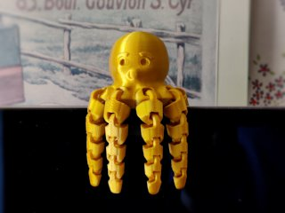
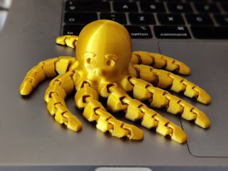
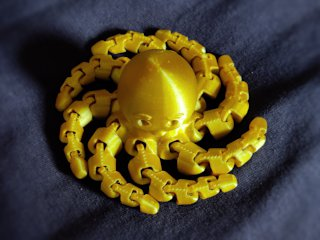
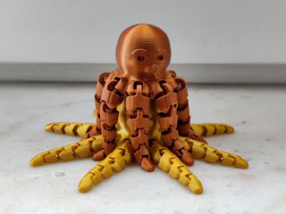
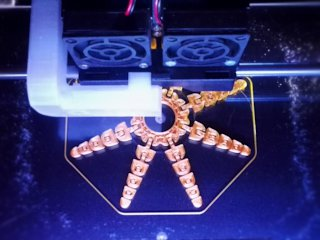

# Funny Flexi Octopus
*3D printable flexible articulated octopus (formerly thing:3531563)*

### License
[Creative Commons - Attribution](https://creativecommons.org/licenses/by/4.0/)

### Attribution

This model is inspired by [McGybeer's Cute Mini Octopus](https://www.thingiverse.com/thing:3495390). However, this was re-created from the ground up in Blender, which means it is not a remix.

### Gallery

[🔎](images/photo1.jpg) [🔎](images/photo2.jpg) [🔎](images/photo3.jpg) [🔎](images/photo4.jpg) [🔎](images/photo5.jpg)

## Description and Instructions

This is a print-in-place octopus with flexible legs, in the same style as [McGybeer's Cute Mini Octopus](https://www.thingiverse.com/thing:3495390). Just for fun, as a toy or fidget, or to show off the possibilities of 3D printing. Unlike the original, this one has no mouth on the side, which allows to print it entirely without supports. It also makes it slightly more realistic because real octopuses (or *octopodes* for the linguistic fanatics) have their mouth at the bottom. This is where the striving for realism ends though, because real octopuses obviously do not have a nose or eyebrows either.

The Blender source files are provided and are a good illustration of how I usually go about designing a model like this.

### Printing

For a strong result, use 3 perimeters. Infill doesn't matter much. No supports required at all.

A 0.2 mm layer height should work well, but 0.15 mm as shown in the photos gives a smoother result (expect between 4 to 5 hours print time at this resolution).
If your slicer supports variable layer height, using thinner layers for the top of the head will provide an even nicer result (in the photos, the topmost layers are 0.1 mm).

If you can, position the seam at the back of the head to get the nicest result, especially when printing with a silky filament as in the photos. In PrusaSlicer, you can use the seam painting feature for this.

This can be scaled up at will. Scaling down could be challenging and will likely lead to a seized-up or fragile result.

### Post-printing

Depending on how stringy the filament is, you may need to wiggle each joint to loosen it completely. If you place the octopus on a flat surface and rotate it by the head, it should look like the third photo if you correctly loosened the joints.

## Licensing

This model has an interesting licensing history. If you just want to know how to legally sell prints, skip to the ‘practical’ section below.

This originally started out as a straightforward remix of McGybeer's *Cute Mini Octopus.* That was possible due to the license under which that model was originally released, but shortly after, its license was changed to a more restrictive one. Because the remix caused major headaches for the original author, he reached out to me and we resolved this situation by me creating a similar but noticeably different model from scratch with a different name. The Funny Flexi Octopus bears the same license as my former remix.

Those who downloaded my original remix can in theory keep printing it if they still have the files. However, we kindly ask everyone selling it to either switch to my Funny Flexi Octopus, or contact [McGybeer](https://www.thingiverse.com/McGybeer) about licensing the original Cute Mini Octopus. This will make things much simpler for everyone.\
If you switch to my Flexi Octopus, you only need to update the name and your attribution message as explained below, the license itself is the same as before.

### Practical: what to do when selling prints

If you want to print and sell the Funny Flexi Octopus, keep in mind that it is released under a [Creative Commons Attribution license](https://creativecommons.org/licenses/by/4.0/). My interpretation of this license is the following.

* If you **sell or give away prints** of this model, you need to **provide attribution.** This means you must always provide *a clearly visible reference* to the source of the model, both on the webpage where you sell or display the model, and on a piece of paper included with each physical product. **This is a very easy requirement** that does not incur any significant extra cost. Here is an example of a full attribution message:\
  “[Funny Flexi Octopus by DrLex](https://github.com/DrLex0/print3d-funny-flexi-octopus) on GitHub, released under a [*Creative Commons Attribution* license](https://creativecommons.org/licenses/by/4.0/).”\
  For the required attribution message on your website/store, simply copy the above line, ensure the hyperlink to this GitHub page is preserved (or re-add it), and you're done.\
  As for the physical printed object, put a similar message on a piece of paper. Print it, write it, 3D print it, I don't care as long as it's there. Simplest is to use the ready-to-print attribution cards in PDF format that can be found in this repository.
* If you **remix** this model and you sell prints of that remix, the origin should be attributed as described in the previous point. You can change the message to: *“Based on Funny Flexi Octopus by DrLex.”* You don't need to use the same attribution cards, but it must be obvious that your prints were derived from my model, and must provide a link to this GitHub page.
* You are *not* obliged to make the 3D model for a **remix** available, this is not a `SA` license. If you do publish the 3D model, it must have the same `CC BY` license or a more restrictive one. You must provide a visible link to this GitHub page wherever your remixed model is published.
* You **do not need to ask explicit permission** from me to sell prints of this model or a remix. Just do the above. Of course it is fine for you to drop me a message, but you don't need to.
* You **do not need to share profits,** although of course you may. [On my site you can find a few ways to donate](https://www.dr-lex.be/about/#contact), should you want to.

### Practical: when displaying this model on a webpage or in a video

To comply with the [Creative Commons Attribution license](https://creativecommons.org/licenses/by/4.0/), you need to provide *attribution,* which is really simple.

* If you display **photos** of the 3D model or 3D printed copies on a webpage: add the same kind of attribution message as when selling objects. In other words, this one:\
  “[Funny Flexi Octopus by DrLex](https://github.com/DrLex0/print3d-funny-flexi-octopus) on GitHub, released under a [CC BY license](https://creativecommons.org/licenses/by/4.0/).”\
  If there really is no way to provide hyperlinks, the above line of text, possibly as a text overlay in the image, suffices because it contains enough information for people to find this source page, but you must provide links when possible.
* If you show the model or prints of it in a **video:** include the same message, either spoken, in a text overlay, or in the video's ‘end credits.’ If the video has a separate textual description, add the same message with link as above.

## Common Sense

Needless to say, this contains small parts and should not be used as a toy for unsupervised little children due to possible choking hazards.

## Updates

### 2019/03/31
Remix of `JR_Jae`'s model published on Thingiverse. A while later, the original source model changed its license (and `JR_Jae` became `McGybeer`).

### 2022/05/28
Replaced remix with new model rebuilt from scratch and changed the name, to get rid of the licensing confusion.\
Migrated to GitHub.

## Tags

`Articulated`, `cute`, `cute_octopus`, `flexible`, `funny`, `octopus`, `print_in_place`, `tentacle`, `tentacles`
